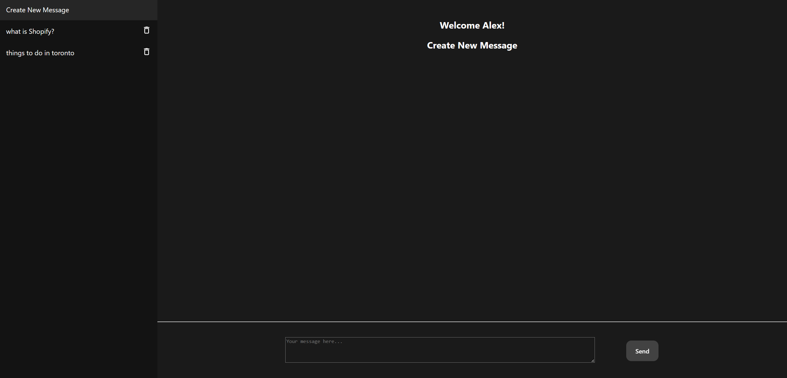
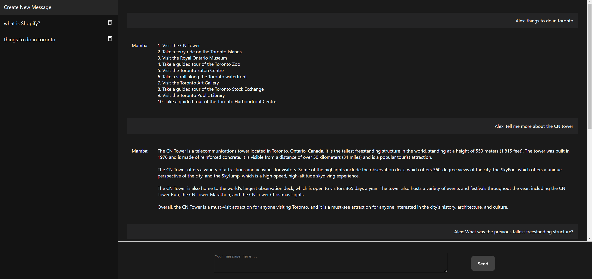

# snake-whisperer
A web based chatting application with Mamba




## Getting started
### Frontend
To run the frontend, `cd frontend` and then run `npm start`

### Backend 
See [manage-server.sh](./manage-server.sh) for usage

```shell
 -r|--runserver
 -k|--make-migration
 -m|--migrate
 -f|--flush
```

Example usage: `./manage-server.sh -f -r`. This will flush the db and then run the server